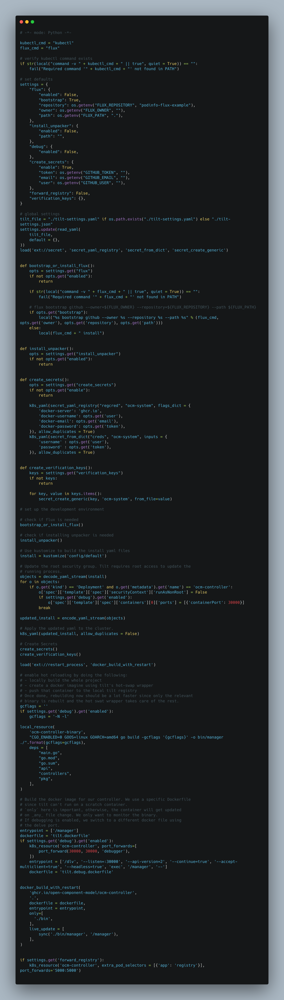

### controller e2e framework

Gergely Brautigam - Weaveworks

https://github.com/Skarlso

https://twitter.com/Skarlso

<!--
Points to talk about...
- Old ways of testing controllers
    - building the test image and pushing to:
        - either latest tag -> hard to reproduce once it's overwritten
        - or generated tag -> where do you get the right manifests from, the right version, and spamming the container registry
    - running it locally -> you aren't testing rbac, manifests, etc...
    -
-->

---

### Small introduction


---

### Gather some data

- Number of people using/testing controllers
- Number of people developing controllers
- Number of people who know Tilt
- Number of people who know about prow / e2e-framework

---


---


---

To this



---

### Starlark

```python
# verify kubectl command exists
if str(local("command -v " + kubectl_cmd + " || true", quiet = True)) == "":
    fail("Required command '" + kubectl_cmd + "' not found in PATH")

# Use kustomize to build the install yaml files
install = kustomize('config/default')

# Update the root security group. Tilt requires root access to update the
# running process.
objects = decode_yaml_stream(install)
for o in objects:
    if o.get('kind') == 'Deployment' and o.get('metadata').get('name') == 'test-1-controller':
        o['spec']['template']['spec']['securityContext']['runAsNonRoot'] = False
        break

updated_install = encode_yaml_stream(objects)

# Apply the updated yaml to the cluster.
# Allow duplicates so the e2e test can include this tilt file with other tilt files
# setting up the same namespace.
k8s_yaml(updated_install, allow_duplicates = True)
```

---

### User Settings

```python
# set defaults
settings = {
    "debug": {
        "enabled": False,
    },
    "create_secrets": {
        "enable": True,
        "token": os.getenv("GITHUB_TOKEN", ""),
        "email": os.getenv("GITHUB_EMAIL", ""),
        "user": os.getenv("GITHUB_USER", ""),
    },
    "forward_registry": False,
}

# user settings
tilt_file = "./tilt-settings.yaml" if os.path.exists("./tilt-settings.yaml") else "./tilt-settings.json"
settings.update(read_yaml(
    tilt_file,
    default = {},
))
```
---

### Including Other Tiltfiles

_We'll use this feature later on._

```python
include('../projectA/Tiltfile')
include('../projectB/Tiltfile')
```

---

### E2E-Framework


---

#### What is e2e-framework?

Set of functions to do the following:

- start, stop kind clusters
- setup functions that can configure a cluster with objects
- teardown that can clean up a cluster
- assess functions that can test various conditions of a cluster object
- these "steps" are composable and extractable to create common/shared resources
- the context can be used to drag objects from one step to the other ( an initialized client for example )

---

### A simple TestMain structure for a suite

```go
func TestMain(m *testing.M) {
	cfg, _ := envconf.NewFromFlags()
	testEnv = env.NewWithConfig(cfg)
	kindClusterName = envconf.RandomName("test-controller-e2e", 32)
	namespace = envconf.RandomName("namespace", 16)

	testEnv.Setup(
		envfuncs.CreateKindCluster(kindClusterName),
		envfuncs.CreateNamespace(namespace),
	)

	testEnv.Finish(
		envfuncs.DeleteNamespace(namespace),
		envfuncs.DestroyKindCluster(kindClusterName),
	)

	os.Exit(testEnv.Run(m))
}
```

---

### A simple Setup function

```go
// ApplyTestData takes a pattern and applies that from a testdata location.
func ApplyTestData(addToSchemeFunc func(s *runtime.Scheme) error, namespace, pattern string) features.Func {
	return func(ctx context.Context, t *testing.T, c *envconf.Config) context.Context {
		t.Helper()
		t.Log("in setup phase")

		r, err := resources.New(c.Client().RESTConfig())
		if err != nil {
			t.Fail()
		}

		if err := decoder.DecodeEachFile(
			ctx, os.DirFS("./testdata"), pattern,
			decoder.CreateHandler(r),
			decoder.MutateNamespace(namespace),
		); err != nil {
			t.Fail()
		}

		t.Log("set up is done, component version should have been applied")

		return ctx
	}
}
```

---

### A simple Assess function

```go
func ResourceWasCreated(name, namespace string, obj k8s.Object) features.Func {
	return func(ctx context.Context, t *testing.T, c *envconf.Config) context.Context {
		t.Helper()
		t.Log("check if resources are created")

		r, err := resources.New(c.Client().RESTConfig())
		if err != nil {
			t.Fail()
		}

		if err := r.Get(ctx, name, namespace, obj); err != nil {
			t.Fail()
		}

		t.Log("resource successfully created")

		return ctx
	}
}
```

---

### Running

`go test ./...`

---

### Now comes the fun part


---

### Combining e2e-framework with Tilt in TestMain

```go
func TestMain(m *testing.M) {
	cfg, _ := envconf.NewFromFlags()
	testEnv = env.NewWithConfig(cfg)
	kindClusterName = envconf.RandomName("test-controller-e2e", 32)
	namespace = envconf.RandomName("namespace", 16)

	testEnv.Setup(
		envfuncs.CreateKindCluster(kindClusterName),
		envfuncs.CreateNamespace(namespace),
+		shared.RunTiltForControllers("test-1-controller", "test-2-controller"),
	)

	testEnv.Finish(
		envfuncs.DeleteNamespace(namespace),
		envfuncs.DestroyKindCluster(kindClusterName),
	)

	os.Exit(testEnv.Run(m))
}
```
---

### Generating an On-The-Fly Tiltfile

```go
// current running folder
_, dir, _, _ := runtime.Caller(0)

// for each of the defined controllers
for _, controller := range controllers {
    // look for a folder called the specified controller by
    // going outside until `/` is reached or the folder is found
    path, err := lookForController(controller, dir)
    if err != nil {
        return ctx, fmt.Errorf("controller with name %q not found", controller)
    }

    // include the project Tiltfile.
    tiltFile += fmt.Sprintf("include('%s/Tiltfile')\n", path)
}
```

---

### Running Tilt in CI mode


---

Simply run

```
tilt ci
```

---

### Extra - Pimping Tilt


---

### Custom build and apply functions

```python
  k8s_custom_deploy(
    'knative-crds',
    deps=[],
    apply_cmd="""
set -e
kubectl apply -f https://github.com/knative/serving/releases/download/knative-%s/serving-crds.yaml -o yaml
kubectl wait --for=condition=Established crd -l=knative.dev/crd-install=true 1>&2
""" % version,
    delete_cmd=delete_crds_cmd
  )
```

---

### Custom Executer

If starting time appears to be too slow, it's possible
to implement Tilt job runners.

https://github.com/kubernetes-sigs/cluster-api/blob/e4e35b0789ee1ed248d93561bc8dbb00e5983b04/hack/tools/tilt-prepare/main.go

---

**Thank You!**

https://github.com/Skarlso